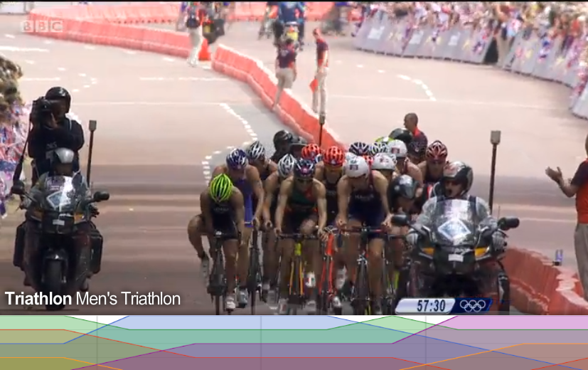

# Londinium MMXII 

<iframe width="800px" height="600px" src="http://medalrivalry.herokuapp.com/rivals.html?year=2008&amp;category=Cycling&amp;size=500"></iframe>

- [Data Visualization London](http://www.meetup.com/Data-Visualization-London/)

## Introduction

- Makoto Inoue (@makoto_inoue)
- MMXII Hackathon (New Bamboo & Pusher)

## Topics

- MMVIII
- MMXII
- MMXVI

## MMVIII

2008 August 8 - 24

### Technology

- iPhone = 2007 June
- Facebook Platform = 2007 May
- The AppStore = 2008 July
- BBC iPlayer = 2007 December
- Android = 2008 October

### Social Media

#### YouTube

#### Facebook

#### Twitter

### Infographic

From[Google Trend](http://www.google.com/trends/?q=infographic)

### Data Visualisation

- [Many Eyes medal counts](http://www-958.ibm.com/software/data/cognos/manyeyes/visualizations/olympics-2008-medals-by-event-top--3)

<embed width="960" height="450" src="http://graphics8.nytimes.com/packages/flash/olympics/20080804_MEDALCOUNT_MAP/flash/medals_cartogram4.swf" quality="high" pluginspage="http://www.macromedia.com/go/getflashplayer" align="middle" play="true" loop="true" scale="showall" wmode="window" devicefont="false" bgcolor="#ffffff" name="medals_cartogram4" menu="true" allowfullscreen="false" allowscriptaccess="always" flashvars="dataPath=http://graphics8.nytimes.com/packages/html/olympics/2008/medals_map/&amp;yearDataPath=http://graphics8.nytimes.com/packages/html/olympics/2008/medals_map/" salign="" type="application/x-shockwave-flash">

- [New York Times medal counts](http://www.nytimes.com/interactive/2008/08/04/sports/olympics/20080804_MEDALCOUNT_MAP.html)

<iframe src="http://c4news.com/livepages/olympics2008/c4/olympicsResults.html" width=1000px height=600px></iframe>

- [Channel 4 medal counts](http://c4news.com/livepages/olympics2008/c4/olympicsResults.html)

<iframe src="http://www-958.ibm.com/software/data/cognos/manyeyes/visualizations/olympics-2008-medals-by-event-top--3" width=1000px height=600px></iframe>

### Visualisation tools

- Many Eyes (Java)
- Flash

### Technology (JS)

- Processing.js = 2008 May
- Raphael.js    = 2008 Sep
- Protoviz      = 2009 April

### Conclusion of MMVIII

- Medal Counts
- Flash/Java

## MMXII

2012 July 29 - Aug 

### Technology

- Mobile (iPhone, Android, iPad)
- Social (Facebook, Twitter, FourSquare)
- Big Data, Cloud, etc
- Video  (Youtube, BBC iPlayer)

### Data Visualization

#### BBC Interactive iPlayer

<iframe src="http://www.bbc.co.uk/sport/olympics/2012/live-video/p00w31zk" width=800px height=600px></iframe>

#### Visualizing.org London 2012 

http://visualizing.org/visualizations/rising-olympic-mountains
http://christiangross.info/olympics/

<iframe src="http://christiangross.info/olympics/" width="1000" height="1200"></iframe>

#### NYT 100 meter dash

<embed type="application/x-shockwave-flash" src="http://graphics8.nytimes.com/packages/flash/multimedia/VIDEO_PLAYER/NYTVideoEmbed2.swf" width="970" height="546" style="undefined" id="nytmm_flashVideoPlayer0" name="nytmm_flashVideoPlayer0" bgcolor="#ffffff" quality="high" allowscriptaccess="always" allowfullscreen="true" wmode="transparent" flashvars="videoWidth=970&amp;videoHeight=546&amp;skin=light&amp;autoPlay=false&amp;autoRewind=true&amp;overlayMode=true&amp;showControls=true&amp;fullScreen=true&amp;embedId=nytmm_flashVideoPlayer0">

### The Hackathon

#### How it went

<noscript>[<a href="http://storify.com/makoto_inoue/hackathon-summary" target="_blank">View the story "Hackathon summary" on Storify</a>]</noscript>

#### Apps

#### Mmxii Earth

<iframe width="560" height="315" src="http://www.youtube.com/embed/1v7rJWYXKuY" frameborder="0" allowfullscreen></iframe>

#### Olympic Record Evolution

<iframe src="http://jgwhite.github.com/mmxii-olympic-record-evolution/" width="1000px" height="600px"></iframe>

#### 8 Beer Sprint

<iframe src="http://8beersprint.defsprite.com/" width="1000px" height="600px"></iframe>

#### Result

"At the end of July, as the Games got underway, developers took part in the first Olympic hackday"

- [Guardian: London 2012, is this the first open data Olympics?](http://www.guardian.co.uk/commentisfree/2012/aug/03/london-2012-olympics-open-data)

### London 2012: is this the first open data Olympics?

- "every athlete coming to London for the Games is registered by London 2012 and their details published on this website. It's deliberately set up to be almost impossible to scrape, even for our own pretty experienced team."

- "As for live results, it may be broadcast in front of your eyes but reusing and reproducing it is a no-go, largely because it still costs money to get the data in the first place."

- "So, is it the first Open data Olympics? Not this time. But it is the first data Olympics."

### Conclusion of MMXII

- Medal Counts + Social Media + Geo
- JavaScript (d3js the winner)
- NOT Open Data

## MMXVI

### Prediction

The future is already here – it's just not evenly distributed.
—William Gibson, quoted in The Economist, December 4, 2003

### What if ?

- Detailed result of Olympic is available?
- 

<noscript>[<a href="http://storify.com/makoto_inoue/sports-tech-hackday" target="_blank">View the story "Sports Tech HackDay" on Storify</a>]</noscript>

### Possessed

<iframe src="http://makoto.github.com/possessed" width="1000px" height="1000px"></iframe>

- [Possessed](http://makoto.github.com/possessed)

### BBC iPlayer

- 

### BBC (Data Driven) iPlayer

- 

## Thanks && References

- [Olympics medals share country](http://www.guardian.co.uk/sport/datablog/interactive/2012/jul/03/olympics-2012-medals-share-country)
- [More Olympics Medal Table Visualisations](http://blog.ouseful.info/2008/08/24/more-olympics-medal-table-visualisations/) = By Tony Hirst, 2008
- [Infographic: whats different about the 2012 olympics social media basically ](http://www.fastcodesign.com/1670386/infographic-whats-different-about-the-2012-olympics-social-media-basically)
- [Wikipedia: Android](http://en.wikipedia.org/wiki/Android_(operating_system))
- [Wikipedia: iPhone](http://en.wikipedia.org/wiki/History_of_the_iPhone)
- [Wikipedia: BBC iPlayer](http://en.wikipedia.org/wiki/BBC_iPlayer)
- [Apple iPhone History in pictures](http://www.telegraph.co.uk/technology/picture-galleries/5477324/Apple-iPhones-history-in-pictures.html)
- [Bolt 2008 Image](http://globalvoicesonline.org/2008/08/21/jamaica-lightning-strikes-twice-at-beijing-olympics/)
- [Bolt 2012  Image](http://www.slate.com/articles/sports/fivering_circus/2012/08/usain_bolt_2012_olympics_watch_the_world_s_fastest_man_blow_away_the_field_in_our_interactive_stick_figure_re_enactment_.html)
- [Neymar Bolt pose](http://www.acrenoticia.com/index.php?option=com_content&view=article&id=8668:neymar-explica-comemoracao-era-para-o-bolt-fizemos-o-mesmo-sinal-&catid=41:futebol&Itemid=69)
- [Olympic medal rivalry](http://blog.new-bamboo.co.uk/2012/06/22/olympic-medal-rivalry)
- [BBC: The best video from the London 2012 Olympic Games ](http://www.bbc.co.uk/sport/olympics/2012/live-video)
- [Visualizing.org](http://www.visualizing.org/stories/visualizing-london-2012-olympic-games-challenge-winners)
- [NYT the 100 meter dash](http://www.nytimes.com/interactive/2012/08/05/sports/olympics/the-100-meter-dash-one-race-every-medalist-ever.html)
- [Web Makers gather for 24 hour app making marathon for the summr of sport](http://blog.new-bamboo.co.uk/2012/07/30/web-makers-gather-for-24-hour-app-making-marathon-for-the-summer-of-sport)
- [Hackathon results](http://hackathon.new-bamboo.co.uk/)
- [Guardian: London 2012 Olympics Open Data ](http://www.guardian.co.uk/commentisfree/2012/aug/03/london-2012-olympics-open-data)